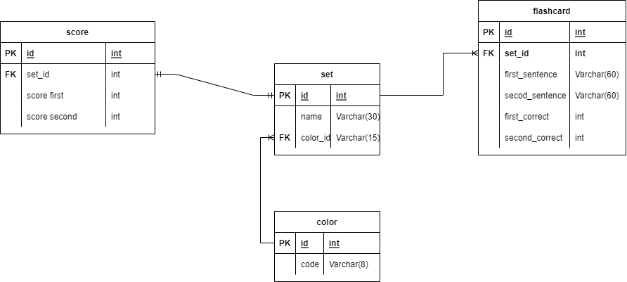

# Flashcard
Simple app that helps you study languages.
## Table of Contents
* [General Info](#general-info)
* [Technologies Used](#technologies-used)
* [Setup](#setup)
* [Database](#database)
* [First Steps](#first-steps)

## General Info
Flashcard is a university project but also helps me to better understand Spring, Hibernate and client-server architecture.
I think everybody knows paper flashcard, but I think better option it to use technology. With this app you 
can easily create new set, change languages, check your score and personalize your set with colors.

## Technologies Used
* Java 17
* JavaFX 17
* CSS
* PostgreSQL
* Hibernate
* Spring
* Gson

## Setup
**You can [download it here](https://github.com/bladeours/flashcards/releases)**
 
After downloading and unzip you will see two folders `client` and `server`.
 
All you have to do is open terminal, go to server folder and run `java -jar serverFlashcard.jar`. After that you can go
to client folder and run `Flashcard.exe`.
 
I needed to add some VM options in Intellij to properly run this program:
 
`--add-modules=ALL-SYSTEM --add-opens=com.flashcard/com.flashcard=ALL-UNNAMED --add-opens=com.flashcard/com.flashcard=spring.core --add-opens=com.flashcard/com.flashcard.controller=spring.core`

## Database
In this project I'm using postgreSQL as my database, you can [download](https://github.com/bladeours/flashcards/releases) script to create all tables.
Also, here is database structure:
 

## First steps

**Rules:**
 
After clicking on set and choosing language you will see rectangle with sentence. You can check translate by
clicking on rectangle then you can choose if you knew it or not. Sets are shuffled and sentence where you choose
`correct` will not be visible until you reset score in `Score` view.

**Create new set:**
 
Just click `Create new`, under set name you can pick color of your set.
 
No field can be empty and set name has to be unique.

**Reset score:**
 
You can reset score for language in `Score` view then by clicking `X` button next to
your score.

